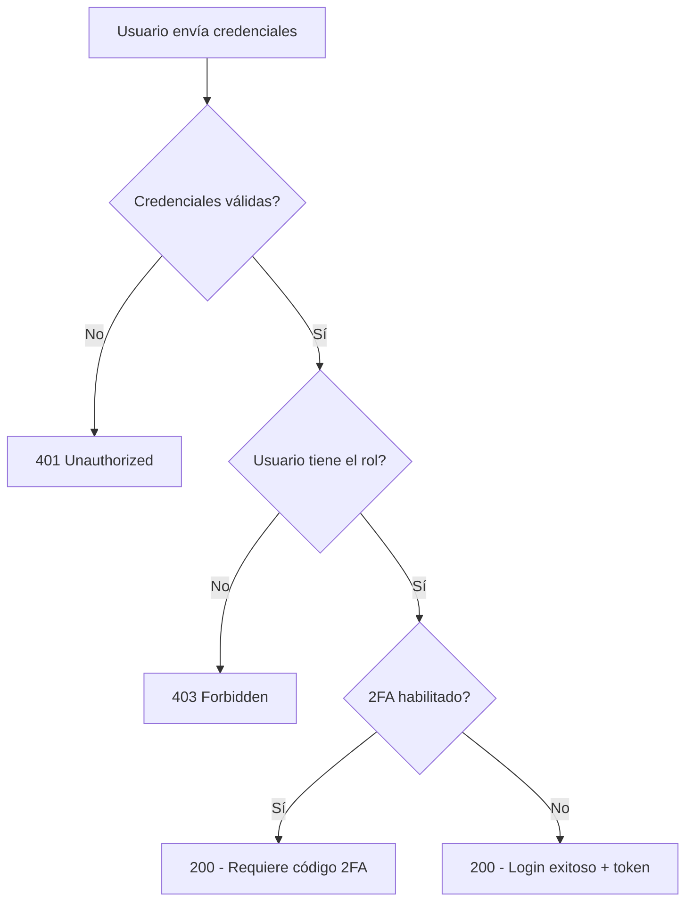

# Guía de Autenticación para Frontend - TechProc API

> **Documentación completa del sistema de autenticación**
> Incluye: Login, Registro, 2FA, Recovery Email, Gestión de Perfil y Reset de Contraseña

---

## Tabla de Contenidos

1. [Introducción](#introducción)
2. [Configuración Inicial](#configuración-inicial)
3. [Registro de Usuario](#registro-de-usuario)
4. [Login y Autenticación](#login-y-autenticación)
5. [Gestión de Perfil](#gestión-de-perfil)
6. [Recovery Email](#recovery-email)
7. [Autenticación de Dos Factores (2FA)](#autenticación-de-dos-factores-2fa)
8. [Recuperación de Contraseña](#recuperación-de-contraseña)
9. [Cerrar Sesión](#cerrar-sesión)
10. [Manejo de Errores](#manejo-de-errores)
11. [Ejemplos de Implementación](#ejemplos-de-implementación)

---

## Introducción

El sistema de autenticación de TechProc utiliza **Laravel Sanctum** para la gestión de tokens. Todas las rutas protegidas requieren un token de autenticación Bearer en el header.

### Características Principales

- ✅ Registro con roles
- ✅ Login con validación de roles
- ✅ Autenticación de dos factores (2FA) con Google Authenticator
- ✅ Email de recuperación con verificación por código
- ✅ Reset de contraseña
- ✅ Gestión completa de perfil
- ✅ Tokens seguros con Sanctum

---

## Configuración Inicial

### Base URL

```typescript
// Desarrollo
const API_BASE_URL = 'http://localhost:8000/api';

// Producción
const API_BASE_URL = 'https://api.techproc.edu/api';
```

### Axios Configuration

```typescript
// lib/axios.ts
import axios from 'axios';

const apiClient = axios.create({
  baseURL: process.env.NEXT_PUBLIC_API_URL || 'http://localhost:8000/api',
  headers: {
    'Content-Type': 'application/json',
    'Accept': 'application/json',
  },
});

// Interceptor para agregar token
apiClient.interceptors.request.use(
  (config) => {
    const token = localStorage.getItem('auth_token');
    if (token) {
      config.headers.Authorization = `Bearer ${token}`;
    }
    return config;
  },
  (error) => Promise.reject(error)
);

// Interceptor para manejar errores de autenticación
apiClient.interceptors.response.use(
  (response) => response,
  (error) => {
    if (error.response?.status === 401) {
      // Token inválido o expirado
      localStorage.removeItem('auth_token');
      localStorage.removeItem('user');
      window.location.href = '/login';
    }
    return Promise.reject(error);
  }
);

export default apiClient;
```

### TypeScript Interfaces

```typescript
// types/auth.ts

export interface User {
  id: number;
  name: string;
  fullname: string;
  email: string;
  dni: string | null;
  phone: string | null;
  avatar: string | null;
  recovery_email: string | null;
  recovery_email_verified: boolean;
  two_factor_enabled: boolean;
  roles: string[];
  permissions: string[];
}

export interface AuthResponse {
  success: boolean;
  message: string;
  data: {
    user: User;
    token: string;
  };
}

export interface ErrorResponse {
  success: false;
  message: string;
  errors?: Record<string, string[]>;
  error?: string;
}

export type Role = 'admin' | 'user' | 'teacher' | 'student' | 'support';
```

---

## Registro de Usuario

### Endpoint

```
POST /auth/register
```

### Request Body

```typescript
interface RegisterRequest {
  name: string;                    // Requerido
  email: string;                   // Requerido, único
  password: string;                // Requerido, mínimo 8 caracteres
  password_confirmation: string;   // Requerido, debe coincidir con password
  role: Role;                      // Requerido, debe existir en la BD
  dni?: string;                    // Opcional, 8 caracteres, único
  fullname?: string;               // Opcional
  avatar?: string;                 // Opcional, URL de imagen
  phone?: string;                  // Opcional
}
```

### Validaciones

| Campo | Reglas |
|-------|--------|
| `name` | Requerido, string, máximo 255 caracteres |
| `email` | Requerido, email válido, único en BD |
| `password` | Requerido, string, mínimo 8 caracteres |
| `password_confirmation` | Requerido, debe ser igual a password |
| `role` | Requerido, debe existir en tabla roles |
| `dni` | Opcional, 8 caracteres, único si se proporciona |
| `fullname` | Opcional, string, máximo 255 caracteres |
| `avatar` | Opcional, string, máximo 500 caracteres |
| `phone` | Opcional, string, máximo 20 caracteres |

### Ejemplo de Request

```json
{
  "name": "Juan Pérez",
  "email": "juan.perez@techproc.com",
  "password": "SecurePass123!",
  "password_confirmation": "SecurePass123!",
  "role": "student",
  "dni": "12345678",
  "fullname": "Juan Carlos Pérez López",
  "phone": "+51999888777"
}
```

### Response Exitosa (201 Created)

```json
{
  "success": true,
  "message": "Usuario registrado exitosamente",
  "data": {
    "user": {
      "id": 1,
      "name": "Juan Pérez",
      "fullname": "Juan Carlos Pérez López",
      "email": "juan.perez@techproc.com",
      "dni": "12345678",
      "phone": "+51999888777",
      "avatar": null,
      "roles": ["student"],
      "permissions": []
    },
    "token": "1|abcdef123456..."
  }
}
```

### Response de Error (422 Validation Error)

```json
{
  "success": false,
  "message": "Error de validación",
  "errors": {
    "email": ["El email ya está registrado"],
    "password": ["La contraseña debe tener al menos 8 caracteres"]
  }
}
```

### Response de Error (500 Server Error)

```json
{
  "success": false,
  "message": "Error al registrar usuario",
  "error": "Database connection failed"
}
```

### Implementación en React/TypeScript

```typescript
// services/authService.ts
import apiClient from '@/lib/axios';
import { RegisterRequest, AuthResponse, ErrorResponse } from '@/types/auth';

export const register = async (data: RegisterRequest): Promise<AuthResponse> => {
  const response = await apiClient.post<AuthResponse>('/auth/register', data);
  return response.data;
};

// Componente de Registro
import { useState } from 'react';
import { register } from '@/services/authService';

export default function RegisterForm() {
  const [formData, setFormData] = useState({
    name: '',
    email: '',
    password: '',
    password_confirmation: '',
    role: 'student' as Role,
    dni: '',
    fullname: '',
    phone: ''
  });
  const [errors, setErrors] = useState<Record<string, string[]>>({});
  const [loading, setLoading] = useState(false);

  const handleSubmit = async (e: React.FormEvent) => {
    e.preventDefault();
    setLoading(true);
    setErrors({});

    try {
      const response = await register(formData);

      // Guardar token y usuario
      localStorage.setItem('auth_token', response.data.token);
      localStorage.setItem('user', JSON.stringify(response.data.user));

      // Redirigir al dashboard
      window.location.href = '/dashboard';
    } catch (error: any) {
      if (error.response?.status === 422) {
        setErrors(error.response.data.errors || {});
      } else {
        alert(error.response?.data?.message || 'Error al registrarse');
      }
    } finally {
      setLoading(false);
    }
  };

  return (
    <form onSubmit={handleSubmit}>
      <input
        type="text"
        placeholder="Nombre"
        value={formData.name}
        onChange={(e) => setFormData({ ...formData, name: e.target.value })}
      />
      {errors.name && <span className="error">{errors.name[0]}</span>}

      <input
        type="email"
        placeholder="Email"
        value={formData.email}
        onChange={(e) => setFormData({ ...formData, email: e.target.value })}
      />
      {errors.email && <span className="error">{errors.email[0]}</span>}

      <input
        type="password"
        placeholder="Contraseña"
        value={formData.password}
        onChange={(e) => setFormData({ ...formData, password: e.target.value })}
      />
      {errors.password && <span className="error">{errors.password[0]}</span>}

      <input
        type="password"
        placeholder="Confirmar Contraseña"
        value={formData.password_confirmation}
        onChange={(e) => setFormData({ ...formData, password_confirmation: e.target.value })}
      />

      <select
        value={formData.role}
        onChange={(e) => setFormData({ ...formData, role: e.target.value as Role })}
      >
        <option value="student">Estudiante</option>
        <option value="teacher">Profesor</option>
        <option value="admin">Administrador</option>
      </select>

      <button type="submit" disabled={loading}>
        {loading ? 'Registrando...' : 'Registrarse'}
      </button>
    </form>
  );
}
```

---

## Login y Autenticación

### Endpoint

```
POST /auth/login
```

### Request Body

```typescript
interface LoginRequest {
  email: string;      // Requerido
  password: string;   // Requerido
  role: Role;         // Requerido
}
```

### Ejemplo de Request

```json
{
  "email": "juan.perez@techproc.com",
  "password": "SecurePass123!",
  "role": "student"
}
```

### Flujo de Login



### Response Exitosa SIN 2FA (200 OK)

```json
{
  "success": true,
  "message": "Login exitoso",
  "data": {
    "user": {
      "id": 1,
      "name": "Juan Pérez",
      "fullname": "Juan Carlos Pérez López",
      "email": "juan.perez@techproc.com",
      "dni": "12345678",
      "phone": "+51999888777",
      "avatar": null,
      "roles": ["student"],
      "permissions": ["view-courses", "enroll-courses"]
    },
    "token": "1|abcdef123456..."
  }
}
```

### Response CON 2FA Habilitado (200 OK)

```json
{
  "success": false,
  "requires_2fa": true,
  "message": "Se requiere código de autenticación de dos factores",
  "data": {
    "user_id": 1,
    "email": "juan.perez@techproc.com"
  }
}
```

### Response de Error - Credenciales Incorrectas (401)

```json
{
  "success": false,
  "message": "Credenciales incorrectas"
}
```

### Response de Error - Rol No Permitido (403)

```json
{
  "success": false,
  "message": "No tienes permisos para acceder con el rol especificado"
}
```

### Response de Error - Validación (422)

```json
{
  "success": false,
  "message": "Error de validación",
  "errors": {
    "email": ["El campo email es obligatorio"],
    "role": ["El rol seleccionado no existe"]
  }
}
```

### Implementación Completa

```typescript
// services/authService.ts
import apiClient from '@/lib/axios';
import { LoginRequest, AuthResponse } from '@/types/auth';

export const login = async (data: LoginRequest): Promise<AuthResponse> => {
  const response = await apiClient.post<AuthResponse>('/auth/login', data);
  return response.data;
};

// hooks/useAuth.ts
import { useState } from 'react';
import { login } from '@/services/authService';
import { useRouter } from 'next/router';

export const useAuth = () => {
  const [loading, setLoading] = useState(false);
  const [error, setError] = useState<string | null>(null);
  const router = useRouter();

  const handleLogin = async (email: string, password: string, role: Role) => {
    setLoading(true);
    setError(null);

    try {
      const response = await login({ email, password, role });

      // Verificar si requiere 2FA
      if ('requires_2fa' in response && response.requires_2fa) {
        // Redirigir a página de verificación 2FA
        router.push({
          pathname: '/auth/verify-2fa',
          query: { email, password, role }
        });
        return;
      }

      // Login exitoso
      if (response.success && response.data.token) {
        localStorage.setItem('auth_token', response.data.token);
        localStorage.setItem('user', JSON.stringify(response.data.user));
        router.push('/dashboard');
      }
    } catch (err: any) {
      const message = err.response?.data?.message || 'Error al iniciar sesión';
      setError(message);
    } finally {
      setLoading(false);
    }
  };

  return { handleLogin, loading, error };
};

// Componente de Login
export default function LoginForm() {
  const { handleLogin, loading, error } = useAuth();
  const [formData, setFormData] = useState({
    email: '',
    password: '',
    role: 'student' as Role
  });

  const onSubmit = (e: React.FormEvent) => {
    e.preventDefault();
    handleLogin(formData.email, formData.password, formData.role);
  };

  return (
    <form onSubmit={onSubmit}>
      <h2>Iniciar Sesión</h2>

      {error && <div className="alert alert-error">{error}</div>}

      <div className="form-group">
        <label>Email</label>
        <input
          type="email"
          required
          value={formData.email}
          onChange={(e) => setFormData({ ...formData, email: e.target.value })}
        />
      </div>

      <div className="form-group">
        <label>Contraseña</label>
        <input
          type="password"
          required
          value={formData.password}
          onChange={(e) => setFormData({ ...formData, password: e.target.value })}
        />
      </div>

      <div className="form-group">
        <label>Rol</label>
        <select
          value={formData.role}
          onChange={(e) => setFormData({ ...formData, role: e.target.value as Role })}
        >
          <option value="student">Estudiante</option>
          <option value="teacher">Profesor</option>
          <option value="support">Soporte</option>
          <option value="admin">Administrador</option>
        </select>
      </div>

      <button type="submit" disabled={loading}>
        {loading ? 'Iniciando sesión...' : 'Iniciar Sesión'}
      </button>

      <div className="links">
        <a href="/auth/forgot-password">¿Olvidaste tu contraseña?</a>
        <a href="/auth/register">Crear una cuenta</a>
      </div>
    </form>
  );
}
```

---

## Gestión de Perfil

### Obtener Usuario Autenticado

#### Endpoint

```
GET /auth/me
```

#### Headers Requeridos

```
Authorization: Bearer {token}
```

#### Response (200 OK)

```json
{
  "success": true,
  "data": {
    "user": {
      "id": 1,
      "name": "Juan Pérez",
      "fullname": "Juan Carlos Pérez López",
      "email": "juan.perez@techproc.com",
      "dni": "12345678",
      "phone": "+51999888777",
      "avatar": "https://example.com/avatar.jpg",
      "recovery_email": "recovery@example.com",
      "recovery_email_verified": true,
      "two_factor_enabled": false,
      "roles": ["student"],
      "permissions": ["view-courses", "enroll-courses"]
    }
  }
}
```

### Actualizar Perfil

#### Endpoint

```
PUT /auth/profile
```

#### Headers Requeridos

```
Authorization: Bearer {token}
```

#### Request Body

```typescript
interface UpdateProfileRequest {
  name?: string;                  // Opcional
  email?: string;                 // Opcional, único
  password?: string;              // Opcional, min 8, requiere password_confirmation
  password_confirmation?: string; // Requerido si se envía password
  dni?: string;                   // Opcional, 8 caracteres, único
  fullname?: string;              // Opcional
  avatar?: string;                // Opcional
  phone?: string;                 // Opcional
}
```

#### Ejemplo de Request

```json
{
  "name": "Juan Carlos Pérez",
  "fullname": "Juan Carlos Pérez López",
  "phone": "+51987654321",
  "avatar": "https://example.com/new-avatar.jpg"
}
```

#### Response Exitosa (200 OK)

```json
{
  "success": true,
  "message": "Perfil actualizado exitosamente",
  "data": {
    "user": {
      "id": 1,
      "name": "Juan Carlos Pérez",
      "fullname": "Juan Carlos Pérez López",
      "email": "juan.perez@techproc.com",
      "dni": "12345678",
      "phone": "+51987654321",
      "avatar": "https://example.com/new-avatar.jpg",
      "roles": ["student"],
      "permissions": ["view-courses", "enroll-courses"]
    }
  }
}
```

#### Response de Error (422)

```json
{
  "success": false,
  "message": "Error de validación",
  "errors": {
    "email": ["El email ya está en uso"],
    "password": ["La contraseña debe tener al menos 8 caracteres"]
  }
}
```

### Implementación

```typescript
// services/authService.ts
export const getMe = async () => {
  const response = await apiClient.get('/auth/me');
  return response.data;
};

export const updateProfile = async (data: UpdateProfileRequest) => {
  const response = await apiClient.put('/auth/profile', data);
  return response.data;
};

// Componente de Perfil
export default function ProfilePage() {
  const [user, setUser] = useState<User | null>(null);
  const [formData, setFormData] = useState({
    name: '',
    fullname: '',
    phone: '',
    avatar: ''
  });
  const [loading, setLoading] = useState(false);

  useEffect(() => {
    const fetchUser = async () => {
      try {
        const response = await getMe();
        setUser(response.data.user);
        setFormData({
          name: response.data.user.name,
          fullname: response.data.user.fullname || '',
          phone: response.data.user.phone || '',
          avatar: response.data.user.avatar || ''
        });
      } catch (error) {
        console.error('Error fetching user:', error);
      }
    };
    fetchUser();
  }, []);

  const handleSubmit = async (e: React.FormEvent) => {
    e.preventDefault();
    setLoading(true);

    try {
      const response = await updateProfile(formData);
      setUser(response.data.user);
      localStorage.setItem('user', JSON.stringify(response.data.user));
      alert('Perfil actualizado exitosamente');
    } catch (error: any) {
      alert(error.response?.data?.message || 'Error al actualizar perfil');
    } finally {
      setLoading(false);
    }
  };

  if (!user) return <div>Cargando...</div>;

  return (
    <div className="profile-page">
      <h1>Mi Perfil</h1>

      <div className="profile-header">
        
        <div>
          <h2>{user.fullname}</h2>
          <p>{user.email}</p>
          <span className="badge">{user.roles[0]}</span>
        </div>
      </div>

      <form onSubmit={handleSubmit}>
        <div className="form-group">
          <label>Nombre</label>
          <input
            type="text"
            value={formData.name}
            onChange={(e) => setFormData({ ...formData, name: e.target.value })}
          />
        </div>

        <div className="form-group">
          <label>Nombre Completo</label>
          <input
            type="text"
            value={formData.fullname}
            onChange={(e) => setFormData({ ...formData, fullname: e.target.value })}
          />
        </div>

        <div className="form-group">
          <label>Teléfono</label>
          <input
            type="tel"
            value={formData.phone}
            onChange={(e) => setFormData({ ...formData, phone: e.target.value })}
          />
        </div>

        <button type="submit" disabled={loading}>
          {loading ? 'Guardando...' : 'Guardar Cambios'}
        </button>
      </form>
    </div>
  );
}
```

---

## Recovery Email

El sistema permite configurar un email de recuperación adicional al email principal. Este email debe ser verificado mediante un código de 6 dígitos.

### 1. Agregar Recovery Email

#### Endpoint

```
POST /auth/recovery-email/add
```

#### Headers

```
Authorization: Bearer {token}
```

#### Request Body

```json
{
  "recovery_email": "recovery@example.com"
}
```

#### Validaciones

- El recovery email debe ser diferente al email principal
- El recovery email no puede estar registrado como email principal de otro usuario
- Debe ser un email válido

#### Response Exitosa (200 OK)

```json
{
  "success": true,
  "message": "Email de recuperación agregado. Se ha enviado un código de verificación.",
  "data": {
    "recovery_email": "recovery@example.com",
    "verified": false
  }
}
```

**Nota**: Al agregar el recovery email, automáticamente se envía un código de 6 dígitos al email proporcionado. El código expira en **15 minutos**.

#### Response de Error (400)

```json
{
  "success": false,
  "message": "Este email ya está registrado en el sistema"
}
```

### 2. Verificar Recovery Email

#### Endpoint

```
POST /auth/recovery-email/verify
```

#### Headers

```
Authorization: Bearer {token}
```

#### Request Body

```json
{
  "code": "123456"
}
```

#### Response Exitosa (200 OK)

```json
{
  "success": true,
  "message": "Email de recuperación verificado exitosamente",
  "data": {
    "recovery_email": "recovery@example.com",
    "verified": true,
    "verified_at": "2025-01-20T10:30:00.000000Z"
  }
}
```

#### Response de Error - Código Inválido (400)

```json
{
  "success": false,
  "message": "Código de verificación incorrecto"
}
```

#### Response de Error - Código Expirado (400)

```json
{
  "success": false,
  "message": "El código de verificación ha expirado. Solicita uno nuevo."
}
```

### 3. Reenviar Código

#### Endpoint

```
POST /auth/recovery-email/resend-code
```

#### Headers

```
Authorization: Bearer {token}
```

#### Request Body

```json
{}
```

#### Response Exitosa (200 OK)

```json
{
  "success": true,
  "message": "Nuevo código de verificación enviado a tu email de recuperación"
}
```

### 4. Eliminar Recovery Email

#### Endpoint

```
DELETE /auth/recovery-email/remove
```

#### Headers

```
Authorization: Bearer {token}
```

#### Response Exitosa (200 OK)

```json
{
  "success": true,
  "message": "Email de recuperación eliminado exitosamente"
}
```

### Implementación Completa

```typescript
// services/recoveryEmailService.ts
import apiClient from '@/lib/axios';

export const addRecoveryEmail = async (recovery_email: string) => {
  const response = await apiClient.post('/auth/recovery-email/add', { recovery_email });
  return response.data;
};

export const verifyRecoveryEmail = async (code: string) => {
  const response = await apiClient.post('/auth/recovery-email/verify', { code });
  return response.data;
};

export const resendRecoveryCode = async () => {
  const response = await apiClient.post('/auth/recovery-email/resend-code');
  return response.data;
};

export const removeRecoveryEmail = async () => {
  const response = await apiClient.delete('/auth/recovery-email/remove');
  return response.data;
};

// Componente RecoveryEmail
export default function RecoveryEmailSettings() {
  const [user, setUser] = useState<User | null>(null);
  const [step, setStep] = useState<'add' | 'verify'>('add');
  const [recoveryEmail, setRecoveryEmail] = useState('');
  const [code, setCode] = useState('');
  const [loading, setLoading] = useState(false);

  const handleAddEmail = async (e: React.FormEvent) => {
    e.preventDefault();
    setLoading(true);

    try {
      await addRecoveryEmail(recoveryEmail);
      alert('Código enviado a tu email de recuperación');
      setStep('verify');
    } catch (error: any) {
      alert(error.response?.data?.message || 'Error al agregar email');
    } finally {
      setLoading(false);
    }
  };

  const handleVerifyCode = async (e: React.FormEvent) => {
    e.preventDefault();
    setLoading(true);

    try {
      await verifyRecoveryEmail(code);
      alert('Email de recuperación verificado exitosamente');
      // Refrescar datos del usuario
      window.location.reload();
    } catch (error: any) {
      alert(error.response?.data?.message || 'Código inválido');
    } finally {
      setLoading(false);
    }
  };

  const handleResendCode = async () => {
    try {
      await resendRecoveryCode();
      alert('Nuevo código enviado');
    } catch (error: any) {
      alert(error.response?.data?.message || 'Error al reenviar código');
    }
  };

  const handleRemoveEmail = async () => {
    if (!confirm('¿Estás seguro de eliminar el email de recuperación?')) return;

    try {
      await removeRecoveryEmail();
      alert('Email de recuperación eliminado');
      window.location.reload();
    } catch (error: any) {
      alert(error.response?.data?.message || 'Error al eliminar email');
    }
  };

  return (
    <div className="recovery-email-settings">
      <h2>Email de Recuperación</h2>

      {user?.recovery_email_verified ? (
        <div className="verified">
          <p>Email de recuperación: <strong>{user.recovery_email}</strong></p>
          <span className="badge success">✓ Verificado</span>
          <button onClick={handleRemoveEmail} className="btn-danger">
            Eliminar Email de Recuperación
          </button>
        </div>
      ) : step === 'add' ? (
        <form onSubmit={handleAddEmail}>
          <p>Agrega un email de recuperación para mayor seguridad</p>
          <input
            type="email"
            placeholder="recovery@example.com"
            value={recoveryEmail}
            onChange={(e) => setRecoveryEmail(e.target.value)}
            required
          />
          <button type="submit" disabled={loading}>
            {loading ? 'Enviando...' : 'Agregar Email'}
          </button>
        </form>
      ) : (
        <form onSubmit={handleVerifyCode}>
          <p>Ingresa el código de 6 dígitos enviado a <strong>{recoveryEmail}</strong></p>
          <input
            type="text"
            placeholder="123456"
            maxLength={6}
            value={code}
            onChange={(e) => setCode(e.target.value)}
            required
          />
          <button type="submit" disabled={loading}>
            {loading ? 'Verificando...' : 'Verificar Código'}
          </button>
          <button type="button" onClick={handleResendCode}>
            Reenviar Código
          </button>
        </form>
      )}
    </div>
  );
}
```

---

## Autenticación de Dos Factores (2FA)

TechProc soporta autenticación de dos factores usando **Google Authenticator** o cualquier app compatible con TOTP (Time-based One-Time Password).

### Flujo Completo 2FA

```
1. Usuario habilita 2FA
2. Backend genera secreto y QR code
3. Usuario escanea QR con Google Authenticator
4. Usuario verifica código para activar 2FA
5. En futuros logins, se requiere código 2FA
```

### 1. Habilitar 2FA

#### Endpoint

```
POST /auth/2fa/enable
```

#### Headers

```
Authorization: Bearer {token}
```

#### Request Body

```json
{}
```

#### Response Exitosa (200 OK)

```json
{
  "success": true,
  "message": "Escanea el código QR con Google Authenticator y luego verifica el código para habilitar 2FA",
  "data": {
    "secret": "JBSWY3DPEHPK3PXP",
    "qr_code_url": "otpauth://totp/TechProc:juan@techproc.com?secret=JBSWY3DPEHPK3PXP&issuer=TechProc",
    "recovery_codes": [
      "A1B2C3D4",
      "E5F6G7H8",
      "I9J0K1L2",
      "M3N4O5P6",
      "Q7R8S9T0",
      "U1V2W3X4",
      "Y5Z6A7B8",
      "C9D0E1F2"
    ]
  }
}
```

**IMPORTANTE**: Los códigos de recuperación solo se muestran una vez. El usuario debe guardarlos en un lugar seguro.

#### Response de Error (400)

```json
{
  "success": false,
  "message": "La autenticación de dos factores ya está habilitada"
}
```

### 2. Verificar y Activar 2FA

#### Endpoint

```
POST /auth/2fa/verify
```

#### Headers

```
Authorization: Bearer {token}
```

#### Request Body

```json
{
  "code": "123456"
}
```

#### Response Exitosa (200 OK)

```json
{
  "success": true,
  "message": "Autenticación de dos factores habilitada exitosamente",
  "data": {
    "two_factor_enabled": true
  }
}
```

#### Response de Error (400)

```json
{
  "success": false,
  "message": "Código de verificación inválido"
}
```

### 3. Login con 2FA

Cuando un usuario con 2FA habilitado intenta hacer login, el flujo es:

#### Paso 1: Login Normal

```
POST /auth/login
```

**Response** (usuario tiene 2FA):

```json
{
  "success": false,
  "requires_2fa": true,
  "message": "Se requiere código de autenticación de dos factores",
  "data": {
    "user_id": 1,
    "email": "juan@techproc.com"
  }
}
```

#### Paso 2: Verificar Código 2FA

```
POST /auth/2fa/verify-login
```

**Request Body**:

```json
{
  "email": "juan@techproc.com",
  "password": "SecurePass123!",
  "code": "123456",
  "role": "student"
}
```

**Response Exitosa** (200 OK):

```json
{
  "success": true,
  "message": "Login exitoso",
  "data": {
    "user": {
      "id": 1,
      "name": "Juan Pérez",
      "email": "juan@techproc.com",
      "roles": ["student"],
      "permissions": []
    },
    "token": "1|abcdef123456..."
  }
}
```

**Nota**: El campo `code` puede ser:
- Un código de 6 dígitos de Google Authenticator
- Un código de recuperación (8 caracteres)

### 4. Deshabilitar 2FA

#### Endpoint

```
POST /auth/2fa/disable
```

#### Headers

```
Authorization: Bearer {token}
```

#### Request Body

```json
{
  "password": "SecurePass123!"
}
```

#### Response Exitosa (200 OK)

```json
{
  "success": true,
  "message": "Autenticación de dos factores deshabilitada exitosamente"
}
```

#### Response de Error (400)

```json
{
  "success": false,
  "message": "Contraseña incorrecta"
}
```

### 5. Regenerar Códigos de Recuperación

#### Endpoint

```
POST /auth/2fa/recovery-codes/regenerate
```

#### Headers

```
Authorization: Bearer {token}
```

#### Request Body

```json
{
  "password": "SecurePass123!"
}
```

#### Response Exitosa (200 OK)

```json
{
  "success": true,
  "message": "Nuevos códigos de recuperación generados. Guárdalos en un lugar seguro",
  "data": {
    "recovery_codes": [
      "N1E2W3C4",
      "O5D6E7S8",
      "F9O0R1R2",
      "E3C4O5V6",
      "E7R8Y9C0",
      "O1D2E3S4",
      "H5E6R7E8",
      "G9E0N1E2"
    ]
  }
}
```

### Implementación Completa 2FA

```typescript
// services/twoFactorService.ts
import apiClient from '@/lib/axios';

export const enable2FA = async () => {
  const response = await apiClient.post('/auth/2fa/enable');
  return response.data;
};

export const verify2FA = async (code: string) => {
  const response = await apiClient.post('/auth/2fa/verify', { code });
  return response.data;
};

export const verify2FALogin = async (email: string, password: string, code: string, role: Role) => {
  const response = await apiClient.post('/auth/2fa/verify-login', {
    email,
    password,
    code,
    role
  });
  return response.data;
};

export const disable2FA = async (password: string) => {
  const response = await apiClient.post('/auth/2fa/disable', { password });
  return response.data;
};

export const regenerateRecoveryCodes = async (password: string) => {
  const response = await apiClient.post('/auth/2fa/recovery-codes/regenerate', { password });
  return response.data;
};

// Componente 2FA Settings
export default function TwoFactorSettings() {
  const [user, setUser] = useState<User | null>(null);
  const [step, setStep] = useState<'enable' | 'verify' | 'enabled'>('enable');
  const [qrCodeUrl, setQrCodeUrl] = useState('');
  const [secret, setSecret] = useState('');
  const [recoveryCodes, setRecoveryCodes] = useState<string[]>([]);
  const [code, setCode] = useState('');
  const [password, setPassword] = useState('');
  const [loading, setLoading] = useState(false);

  useEffect(() => {
    const fetchUser = async () => {
      const response = await getMe();
      setUser(response.data.user);
      if (response.data.user.two_factor_enabled) {
        setStep('enabled');
      }
    };
    fetchUser();
  }, []);

  const handleEnable2FA = async () => {
    setLoading(true);
    try {
      const response = await enable2FA();
      setQrCodeUrl(response.data.qr_code_url);
      setSecret(response.data.secret);
      setRecoveryCodes(response.data.recovery_codes);
      setStep('verify');
    } catch (error: any) {
      alert(error.response?.data?.message || 'Error al habilitar 2FA');
    } finally {
      setLoading(false);
    }
  };

  const handleVerify2FA = async (e: React.FormEvent) => {
    e.preventDefault();
    setLoading(true);

    try {
      await verify2FA(code);
      alert('2FA habilitado exitosamente');
      setStep('enabled');
      window.location.reload();
    } catch (error: any) {
      alert(error.response?.data?.message || 'Código inválido');
    } finally {
      setLoading(false);
    }
  };

  const handleDisable2FA = async (e: React.FormEvent) => {
    e.preventDefault();
    setLoading(true);

    try {
      await disable2FA(password);
      alert('2FA deshabilitado exitosamente');
      window.location.reload();
    } catch (error: any) {
      alert(error.response?.data?.message || 'Error al deshabilitar 2FA');
    } finally {
      setLoading(false);
    }
  };

  const handleRegenerateCodes = async () => {
    const pwd = prompt('Ingresa tu contraseña para regenerar los códigos:');
    if (!pwd) return;

    try {
      const response = await regenerateRecoveryCodes(pwd);
      setRecoveryCodes(response.data.recovery_codes);
      alert('Códigos regenerados. Guárdalos en un lugar seguro.');
    } catch (error: any) {
      alert(error.response?.data?.message || 'Error al regenerar códigos');
    }
  };

  return (
    <div className="two-factor-settings">
      <h2>Autenticación de Dos Factores</h2>

      {step === 'enable' && (
        <div>
          <p>Agrega una capa extra de seguridad a tu cuenta</p>
          <button onClick={handleEnable2FA} disabled={loading}>
            {loading ? 'Habilitando...' : 'Habilitar 2FA'}
          </button>
        </div>
      )}

      {step === 'verify' && (
        <div>
          <h3>Paso 1: Escanea el código QR</h3>
          
          <p>O ingresa este código manualmente: <code>{secret}</code></p>

          <h3>Paso 2: Guarda tus códigos de recuperación</h3>
          <div className="recovery-codes">
            {recoveryCodes.map((code, index) => (
              <code key={index}>{code}</code>
            ))}
          </div>
          <p className="warning">⚠️ Guarda estos códigos. Solo se muestran una vez.</p>

          <h3>Paso 3: Verifica el código</h3>
          <form onSubmit={handleVerify2FA}>
            <input
              type="text"
              placeholder="123456"
              maxLength={6}
              value={code}
              onChange={(e) => setCode(e.target.value)}
              required
            />
            <button type="submit" disabled={loading}>
              {loading ? 'Verificando...' : 'Verificar y Activar'}
            </button>
          </form>
        </div>
      )}

      {step === 'enabled' && (
        <div>
          <p className="success">✓ 2FA Habilitado</p>
          <button onClick={handleRegenerateCodes}>
            Regenerar Códigos de Recuperación
          </button>

          <h3>Deshabilitar 2FA</h3>
          <form onSubmit={handleDisable2FA}>
            <input
              type="password"
              placeholder="Contraseña"
              value={password}
              onChange={(e) => setPassword(e.target.value)}
              required
            />
            <button type="submit" disabled={loading} className="btn-danger">
              {loading ? 'Deshabilitando...' : 'Deshabilitar 2FA'}
            </button>
          </form>
        </div>
      )}
    </div>
  );
}

// Componente para login con 2FA
export default function Verify2FAPage() {
  const router = useRouter();
  const { email, password, role } = router.query;
  const [code, setCode] = useState('');
  const [loading, setLoading] = useState(false);

  const handleSubmit = async (e: React.FormEvent) => {
    e.preventDefault();
    setLoading(true);

    try {
      const response = await verify2FALogin(
        email as string,
        password as string,
        code,
        role as Role
      );

      localStorage.setItem('auth_token', response.data.token);
      localStorage.setItem('user', JSON.stringify(response.data.user));
      router.push('/dashboard');
    } catch (error: any) {
      alert(error.response?.data?.message || 'Código inválido');
    } finally {
      setLoading(false);
    }
  };

  return (
    <div className="verify-2fa-page">
      <h2>Verificación de Dos Factores</h2>
      <p>Ingresa el código de Google Authenticator o un código de recuperación</p>

      <form onSubmit={handleSubmit}>
        <input
          type="text"
          placeholder="Código de 6 dígitos"
          value={code}
          onChange={(e) => setCode(e.target.value)}
          required
        />
        <button type="submit" disabled={loading}>
          {loading ? 'Verificando...' : 'Verificar'}
        </button>
      </form>

      <p className="help-text">
        ¿Perdiste acceso a tu autenticador? Usa un código de recuperación.
      </p>
    </div>
  );
}
```

---

## Recuperación de Contraseña

### Flujo Completo

```
1. Usuario solicita reset (forgot-password)
2. Backend envía email con token
3. Usuario hace clic en link del email
4. Frontend muestra formulario para nueva contraseña
5. Usuario envía nueva contraseña + token
6. Backend resetea contraseña y revoca tokens
```

### 1. Solicitar Reset (Forgot Password)

#### Endpoint

```
POST /auth/forgot-password
```

#### Request Body

```json
{
  "email": "juan@techproc.com"
}
```

#### Response Exitosa (200 OK)

```json
{
  "success": true,
  "message": "Se ha enviado un enlace de recuperación a tu correo electrónico"
}
```

#### Response de Error (422)

```json
{
  "success": false,
  "message": "Error de validación",
  "errors": {
    "email": ["El email no está registrado"]
  }
}
```

### 2. Reset de Contraseña

#### Endpoint

```
POST /auth/reset-password
```

#### Request Body

```json
{
  "email": "juan@techproc.com",
  "token": "token_from_email_link",
  "password": "NewSecurePass123!",
  "password_confirmation": "NewSecurePass123!"
}
```

#### Response Exitosa (200 OK)

```json
{
  "success": true,
  "message": "Contraseña actualizada exitosamente. Puedes iniciar sesión con tu nueva contraseña."
}
```

#### Response de Error - Token Inválido (400)

```json
{
  "success": false,
  "message": "Token inválido o expirado. Solicita un nuevo enlace de recuperación."
}
```

### Implementación

```typescript
// services/passwordService.ts
export const forgotPassword = async (email: string) => {
  const response = await apiClient.post('/auth/forgot-password', { email });
  return response.data;
};

export const resetPassword = async (
  email: string,
  token: string,
  password: string,
  password_confirmation: string
) => {
  const response = await apiClient.post('/auth/reset-password', {
    email,
    token,
    password,
    password_confirmation
  });
  return response.data;
};

// Página Forgot Password
export default function ForgotPasswordPage() {
  const [email, setEmail] = useState('');
  const [loading, setLoading] = useState(false);
  const [sent, setSent] = useState(false);

  const handleSubmit = async (e: React.FormEvent) => {
    e.preventDefault();
    setLoading(true);

    try {
      await forgotPassword(email);
      setSent(true);
    } catch (error: any) {
      alert(error.response?.data?.message || 'Error al enviar email');
    } finally {
      setLoading(false);
    }
  };

  if (sent) {
    return (
      <div className="success-message">
        <h2>Email Enviado</h2>
        <p>Revisa tu bandeja de entrada y sigue las instrucciones para resetear tu contraseña.</p>
      </div>
    );
  }

  return (
    <div className="forgot-password-page">
      <h2>¿Olvidaste tu contraseña?</h2>
      <p>Ingresa tu email y te enviaremos un enlace para resetear tu contraseña</p>

      <form onSubmit={handleSubmit}>
        <input
          type="email"
          placeholder="tu@email.com"
          value={email}
          onChange={(e) => setEmail(e.target.value)}
          required
        />
        <button type="submit" disabled={loading}>
          {loading ? 'Enviando...' : 'Enviar Enlace'}
        </button>
      </form>

      <a href="/auth/login">Volver al login</a>
    </div>
  );
}

// Página Reset Password
export default function ResetPasswordPage() {
  const router = useRouter();
  const { token, email } = router.query;
  const [password, setPassword] = useState('');
  const [passwordConfirmation, setPasswordConfirmation] = useState('');
  const [loading, setLoading] = useState(false);

  const handleSubmit = async (e: React.FormEvent) => {
    e.preventDefault();
    setLoading(true);

    try {
      await resetPassword(
        email as string,
        token as string,
        password,
        passwordConfirmation
      );
      alert('Contraseña actualizada exitosamente');
      router.push('/auth/login');
    } catch (error: any) {
      alert(error.response?.data?.message || 'Error al resetear contraseña');
    } finally {
      setLoading(false);
    }
  };

  return (
    <div className="reset-password-page">
      <h2>Resetear Contraseña</h2>
      <p>Ingresa tu nueva contraseña</p>

      <form onSubmit={handleSubmit}>
        <input
          type="password"
          placeholder="Nueva contraseña"
          value={password}
          onChange={(e) => setPassword(e.target.value)}
          required
          minLength={8}
        />
        <input
          type="password"
          placeholder="Confirmar contraseña"
          value={passwordConfirmation}
          onChange={(e) => setPasswordConfirmation(e.target.value)}
          required
        />
        <button type="submit" disabled={loading}>
          {loading ? 'Actualizando...' : 'Resetear Contraseña'}
        </button>
      </form>
    </div>
  );
}
```

---

## Cerrar Sesión

### Endpoint

```
POST /auth/logout
```

### Headers

```
Authorization: Bearer {token}
```

### Response Exitosa (200 OK)

```json
{
  "success": true,
  "message": "Sesión cerrada exitosamente"
}
```

### Implementación

```typescript
// services/authService.ts
export const logout = async () => {
  const response = await apiClient.post('/auth/logout');
  return response.data;
};

// hooks/useAuth.ts
export const useAuth = () => {
  const router = useRouter();

  const handleLogout = async () => {
    try {
      await logout();
    } catch (error) {
      console.error('Error during logout:', error);
    } finally {
      // Limpiar localStorage
      localStorage.removeItem('auth_token');
      localStorage.removeItem('user');

      // Redirigir al login
      router.push('/auth/login');
    }
  };

  return { handleLogout };
};

// Componente Header
export default function Header() {
  const { handleLogout } = useAuth();

  return (
    <header>
      <nav>
        <a href="/dashboard">Dashboard</a>
        <a href="/profile">Perfil</a>
        <button onClick={handleLogout}>Cerrar Sesión</button>
      </nav>
    </header>
  );
}
```

---

## Manejo de Errores

### Códigos de Estado HTTP

| Código | Significado | Cuándo Ocurre |
|--------|-------------|---------------|
| 200 | OK | Operación exitosa |
| 201 | Created | Recurso creado (registro exitoso) |
| 400 | Bad Request | Error en los datos enviados |
| 401 | Unauthorized | Credenciales inválidas o token expirado |
| 403 | Forbidden | Usuario no tiene permisos |
| 422 | Unprocessable Entity | Error de validación |
| 500 | Internal Server Error | Error del servidor |

### Estructura de Errores

#### Error de Validación (422)

```json
{
  "success": false,
  "message": "Error de validación",
  "errors": {
    "email": ["El email ya está registrado"],
    "password": ["La contraseña debe tener al menos 8 caracteres"],
    "dni": ["El DNI debe tener 8 dígitos"]
  }
}
```

#### Error General

```json
{
  "success": false,
  "message": "Descripción del error"
}
```

#### Error del Servidor (500)

```json
{
  "success": false,
  "message": "Error al procesar la solicitud",
  "error": "Detalles técnicos del error"
}
```

### Interceptor de Errores Global

```typescript
// lib/axios.ts
import axios from 'axios';

const apiClient = axios.create({
  baseURL: process.env.NEXT_PUBLIC_API_URL,
  headers: {
    'Content-Type': 'application/json',
    'Accept': 'application/json',
  },
});

// Interceptor de respuesta para manejar errores
apiClient.interceptors.response.use(
  (response) => response,
  (error) => {
    const status = error.response?.status;
    const message = error.response?.data?.message;

    switch (status) {
      case 401:
        // Token inválido o expirado
        localStorage.removeItem('auth_token');
        localStorage.removeItem('user');
        window.location.href = '/auth/login';
        break;

      case 403:
        // Sin permisos
        alert('No tienes permisos para realizar esta acción');
        break;

      case 422:
        // Error de validación - manejado por cada componente
        break;

      case 500:
        // Error del servidor
        alert('Error del servidor. Por favor intenta más tarde.');
        break;

      default:
        if (message) {
          console.error('Error:', message);
        }
    }

    return Promise.reject(error);
  }
);

export default apiClient;
```

### Helper para Manejo de Errores en Componentes

```typescript
// utils/errorHandler.ts
import { ErrorResponse } from '@/types/auth';

export const handleApiError = (error: any): string => {
  if (error.response) {
    const data = error.response.data as ErrorResponse;

    // Error de validación (422)
    if (error.response.status === 422 && data.errors) {
      const firstError = Object.values(data.errors)[0];
      return Array.isArray(firstError) ? firstError[0] : data.message;
    }

    // Otros errores
    return data.message || 'Error al procesar la solicitud';
  }

  // Error de red
  if (error.request) {
    return 'No se pudo conectar con el servidor';
  }

  return 'Error inesperado';
};

// Uso en componentes
try {
  await login(formData);
} catch (error) {
  const errorMessage = handleApiError(error);
  setError(errorMessage);
}
```

---

## Ejemplos de Implementación

### Context Provider para Autenticación

```typescript
// contexts/AuthContext.tsx
import React, { createContext, useContext, useState, useEffect } from 'react';
import { User } from '@/types/auth';
import { getMe } from '@/services/authService';

interface AuthContextType {
  user: User | null;
  loading: boolean;
  isAuthenticated: boolean;
  refreshUser: () => Promise<void>;
}

const AuthContext = createContext<AuthContextType | undefined>(undefined);

export const AuthProvider: React.FC<{ children: React.ReactNode }> = ({ children }) => {
  const [user, setUser] = useState<User | null>(null);
  const [loading, setLoading] = useState(true);

  const refreshUser = async () => {
    try {
      const response = await getMe();
      setUser(response.data.user);
      localStorage.setItem('user', JSON.stringify(response.data.user));
    } catch (error) {
      setUser(null);
      localStorage.removeItem('auth_token');
      localStorage.removeItem('user');
    }
  };

  useEffect(() => {
    const initAuth = async () => {
      const token = localStorage.getItem('auth_token');
      if (token) {
        await refreshUser();
      }
      setLoading(false);
    };

    initAuth();
  }, []);

  const value = {
    user,
    loading,
    isAuthenticated: !!user,
    refreshUser
  };

  return <AuthContext.Provider value={value}>{children}</AuthContext.Provider>;
};

export const useAuth = () => {
  const context = useContext(AuthContext);
  if (!context) {
    throw new Error('useAuth must be used within AuthProvider');
  }
  return context;
};
```

### Protected Route Component

```typescript
// components/ProtectedRoute.tsx
import { useAuth } from '@/contexts/AuthContext';
import { useRouter } from 'next/router';
import { useEffect } from 'react';

interface ProtectedRouteProps {
  children: React.ReactNode;
  requiredRole?: string;
}

export default function ProtectedRoute({ children, requiredRole }: ProtectedRouteProps) {
  const { user, loading, isAuthenticated } = useAuth();
  const router = useRouter();

  useEffect(() => {
    if (!loading) {
      if (!isAuthenticated) {
        router.push('/auth/login');
      } else if (requiredRole && !user?.roles.includes(requiredRole)) {
        router.push('/unauthorized');
      }
    }
  }, [loading, isAuthenticated, user, requiredRole, router]);

  if (loading) {
    return <div>Cargando...</div>;
  }

  if (!isAuthenticated) {
    return null;
  }

  if (requiredRole && !user?.roles.includes(requiredRole)) {
    return null;
  }

  return <>{children}</>;
}

// Uso
<ProtectedRoute requiredRole="admin">
  <AdminDashboard />
</ProtectedRoute>
```

### Persistencia de Sesión

```typescript
// utils/authStorage.ts
import { User } from '@/types/auth';

export const authStorage = {
  setToken: (token: string) => {
    localStorage.setItem('auth_token', token);
  },

  getToken: (): string | null => {
    return localStorage.getItem('auth_token');
  },

  removeToken: () => {
    localStorage.removeItem('auth_token');
  },

  setUser: (user: User) => {
    localStorage.setItem('user', JSON.stringify(user));
  },

  getUser: (): User | null => {
    const userStr = localStorage.getItem('user');
    return userStr ? JSON.parse(userStr) : null;
  },

  removeUser: () => {
    localStorage.removeItem('user');
  },

  clearAll: () => {
    localStorage.removeItem('auth_token');
    localStorage.removeItem('user');
  },

  isAuthenticated: (): boolean => {
    return !!localStorage.getItem('auth_token');
  }
};
```

---

## Resumen de Endpoints

| Método | Endpoint | Autenticación | Descripción |
|--------|----------|---------------|-------------|
| POST | `/auth/register` | No | Registrar nuevo usuario |
| POST | `/auth/login` | No | Iniciar sesión |
| POST | `/auth/logout` | Sí | Cerrar sesión |
| GET | `/auth/me` | Sí | Obtener usuario autenticado |
| PUT | `/auth/profile` | Sí | Actualizar perfil |
| POST | `/auth/forgot-password` | No | Solicitar reset de contraseña |
| POST | `/auth/reset-password` | No | Resetear contraseña |
| POST | `/auth/recovery-email/add` | Sí | Agregar email de recuperación |
| POST | `/auth/recovery-email/verify` | Sí | Verificar email de recuperación |
| POST | `/auth/recovery-email/resend-code` | Sí | Reenviar código de verificación |
| DELETE | `/auth/recovery-email/remove` | Sí | Eliminar email de recuperación |
| POST | `/auth/2fa/enable` | Sí | Habilitar 2FA |
| POST | `/auth/2fa/verify` | Sí | Verificar y activar 2FA |
| POST | `/auth/2fa/verify-login` | No | Completar login con 2FA |
| POST | `/auth/2fa/disable` | Sí | Deshabilitar 2FA |
| POST | `/auth/2fa/recovery-codes/regenerate` | Sí | Regenerar códigos de recuperación |

---

**Última actualización**: 2025-11-09
**Versión**: 1.0.0
**Documentado por**: Backend Team TechProc
