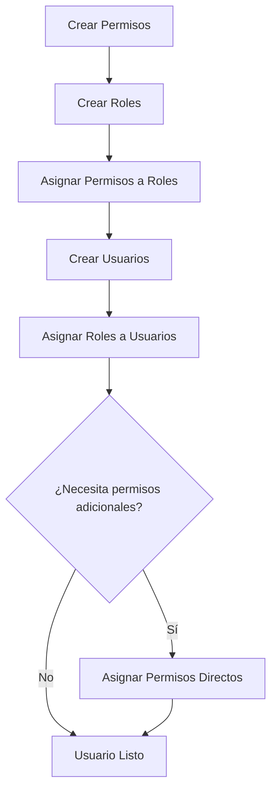

# Guía de Usuarios, Roles y Permisos - TechProc API

> **Documentación completa del sistema RBAC (Role-Based Access Control)**
> Gestión de usuarios, roles y permisos usando Spatie Permission

---

## Tabla de Contenidos

1. [Introducción](#introducción)
2. [Conceptos Básicos](#conceptos-básicos)
3. [Gestión de Usuarios](#gestión-de-usuarios)
4. [Gestión de Roles](#gestión-de-roles)
5. [Gestión de Permisos](#gestión-de-permisos)
6. [Asignación de Roles y Permisos](#asignación-de-roles-y-permisos)
7. [Modelos TypeScript](#modelos-typescript)
8. [Ejemplos de Implementación](#ejemplos-de-implementación)
9. [Manejo de Errores](#manejo-de-errores)
10. [Buenas Prácticas](#buenas-prácticas)

---

## Introducción

TechProc utiliza **Spatie Permission** para implementar un sistema robusto de control de acceso basado en roles (RBAC). Este sistema permite:

- Crear y gestionar usuarios
- Definir roles (admin, teacher, student, support, etc.)
- Crear permisos granulares
- Asignar roles y permisos a usuarios
- Controlar el acceso a recursos mediante políticas (Policies)

### Base URL

```
http://localhost:8000/api (desarrollo)
https://api.techproc.edu/api (producción)
```

### Autenticación

**Todas las rutas de usuarios, roles y permisos requieren autenticación con Bearer Token:**

```http
Authorization: Bearer {token}
```

---

## Conceptos Básicos

### Jerarquía del Sistema

```
Usuario (User)
  └── Roles (Roles)
       └── Permisos (Permissions)
  └── Permisos Directos (Permissions)
```

### Relaciones

- Un **usuario** puede tener **múltiples roles**
- Un **rol** puede tener **múltiples permisos**
- Un **usuario** puede tener **permisos directos** (sin necesidad de rol)
- Un **usuario** hereda todos los permisos de sus roles

### Ejemplo Práctico

```typescript
// Usuario con rol "admin"
const user = {
  id: 1,
  name: "Juan Pérez",
  email: "juan@techproc.com",
  roles: ["admin"],
  permissions: ["*"] // Admin tiene todos los permisos
}

// Usuario con rol "teacher" y permiso directo
const teacher = {
  id: 2,
  name: "María García",
  email: "maria@techproc.com",
  roles: ["teacher"],
  permissions: [
    "view-courses",
    "edit-courses",
    "grade-students",
    "publish-content" // Permiso directo adicional
  ]
}
```

---

## Gestión de Usuarios

### 1. Listar Usuarios

#### Endpoint

```http
GET /users
```

#### Query Parameters

| Parámetro | Tipo | Descripción | Default |
|-----------|------|-------------|---------|
| `per_page` | number | Usuarios por página | 15 |
| `search` | string | Buscar por nombre o email | - |
| `page` | number | Número de página | 1 |

#### Headers

```http
Authorization: Bearer {token}
```

#### Ejemplo de Request

```http
GET /users?per_page=20&search=juan&page=1
```

#### Response Exitosa (200 OK)

```json
{
  "success": true,
  "data": {
    "current_page": 1,
    "data": [
      {
        "id": 1,
        "name": "Juan Pérez",
        "fullname": "Juan Carlos Pérez López",
        "email": "juan@techproc.com",
        "dni": "12345678",
        "phone": "+51999888777",
        "avatar": "https://example.com/avatar.jpg",
        "email_verified_at": "2025-01-15T10:00:00.000000Z",
        "created_at": "2025-01-10T08:00:00.000000Z",
        "updated_at": "2025-01-15T10:00:00.000000Z",
        "roles": [
          {
            "id": 1,
            "name": "admin",
            "guard_name": "api"
          }
        ],
        "permissions": [
          {
            "id": 1,
            "name": "view-users",
            "guard_name": "api"
          },
          {
            "id": 2,
            "name": "create-users",
            "guard_name": "api"
          }
        ]
      }
    ],
    "first_page_url": "http://localhost:8000/api/users?page=1",
    "from": 1,
    "last_page": 5,
    "last_page_url": "http://localhost:8000/api/users?page=5",
    "next_page_url": "http://localhost:8000/api/users?page=2",
    "path": "http://localhost:8000/api/users",
    "per_page": 15,
    "prev_page_url": null,
    "to": 15,
    "total": 72
  }
}
```

#### Response de Error (403 Forbidden)

```json
{
  "success": false,
  "message": "No tienes permisos para ver usuarios"
}
```

### 2. Obtener Usuario por ID

#### Endpoint

```http
GET /users/{id}
```

#### Headers

```http
Authorization: Bearer {token}
```

#### Response Exitosa (200 OK)

```json
{
  "success": true,
  "data": {
    "id": 1,
    "name": "Juan Pérez",
    "fullname": "Juan Carlos Pérez López",
    "email": "juan@techproc.com",
    "dni": "12345678",
    "phone": "+51999888777",
    "avatar": "https://example.com/avatar.jpg",
    "email_verified_at": "2025-01-15T10:00:00.000000Z",
    "created_at": "2025-01-10T08:00:00.000000Z",
    "updated_at": "2025-01-15T10:00:00.000000Z",
    "roles": [
      {
        "id": 1,
        "name": "admin",
        "guard_name": "api"
      }
    ],
    "permissions": []
  }
}
```

#### Response de Error (404 Not Found)

```json
{
  "success": false,
  "message": "Usuario no encontrado"
}
```

### 3. Crear Usuario

#### Endpoint

```http
POST /users
```

#### Headers

```http
Authorization: Bearer {token}
Content-Type: application/json
```

#### Request Body

```typescript
interface CreateUserRequest {
  name: string;                  // Requerido
  email: string;                 // Requerido, único
  password: string;              // Requerido, mínimo 8 caracteres
  dni?: string;                  // Opcional, 8 caracteres, único
  fullname?: string;             // Opcional
  avatar?: string;               // Opcional, URL
  phone?: string;                // Opcional
  roles?: string[];              // Opcional, array de nombres de roles
}
```

#### Validaciones

| Campo | Reglas |
|-------|--------|
| `name` | Requerido, string, máximo 255 caracteres |
| `email` | Requerido, email válido, único |
| `password` | Requerido, string, mínimo 8 caracteres |
| `dni` | Opcional, string, máximo 8 caracteres, único |
| `fullname` | Opcional, string, máximo 255 caracteres |
| `avatar` | Opcional, string, máximo 500 caracteres |
| `phone` | Opcional, string, máximo 20 caracteres |
| `roles` | Opcional, array, cada rol debe existir en BD |

#### Ejemplo de Request

```json
{
  "name": "María García",
  "email": "maria@techproc.com",
  "password": "SecurePass123!",
  "dni": "87654321",
  "fullname": "María Isabel García Rodríguez",
  "phone": "+51987654321",
  "roles": ["teacher"]
}
```

#### Response Exitosa (201 Created)

```json
{
  "success": true,
  "message": "Usuario creado exitosamente",
  "data": {
    "id": 2,
    "name": "María García",
    "fullname": "María Isabel García Rodríguez",
    "email": "maria@techproc.com",
    "dni": "87654321",
    "phone": "+51987654321",
    "avatar": null,
    "email_verified_at": null,
    "created_at": "2025-01-20T14:30:00.000000Z",
    "updated_at": "2025-01-20T14:30:00.000000Z",
    "roles": [
      {
        "id": 2,
        "name": "teacher",
        "guard_name": "api"
      }
    ],
    "permissions": []
  }
}
```

#### Response de Error (422 Validation Error)

```json
{
  "success": false,
  "message": "Error de validación",
  "errors": {
    "email": ["El email ya está registrado"],
    "password": ["La contraseña debe tener al menos 8 caracteres"],
    "roles.0": ["El rol especificado no existe"]
  }
}
```

### 4. Actualizar Usuario

#### Endpoint

```http
PUT /users/{id}
```

#### Headers

```http
Authorization: Bearer {token}
Content-Type: application/json
```

#### Request Body

```typescript
interface UpdateUserRequest {
  name?: string;
  email?: string;               // Único, excepto el usuario actual
  password?: string;            // Opcional, se encripta si se envía
  dni?: string;                 // Único, excepto el usuario actual
  fullname?: string;
  avatar?: string;
  phone?: string;
  roles?: string[];             // Reemplaza los roles existentes
}
```

#### Ejemplo de Request

```json
{
  "name": "María Isabel García",
  "phone": "+51999111222",
  "roles": ["teacher", "admin"]
}
```

#### Response Exitosa (200 OK)

```json
{
  "success": true,
  "message": "Usuario actualizado exitosamente",
  "data": {
    "id": 2,
    "name": "María Isabel García",
    "fullname": "María Isabel García Rodríguez",
    "email": "maria@techproc.com",
    "dni": "87654321",
    "phone": "+51999111222",
    "avatar": null,
    "roles": [
      {
        "id": 2,
        "name": "teacher",
        "guard_name": "api"
      },
      {
        "id": 1,
        "name": "admin",
        "guard_name": "api"
      }
    ],
    "permissions": []
  }
}
```

### 5. Eliminar Usuario

#### Endpoint

```http
DELETE /users/{id}
```

#### Headers

```http
Authorization: Bearer {token}
```

#### Response Exitosa (200 OK)

```json
{
  "success": true,
  "message": "Usuario eliminado exitosamente"
}
```

#### Response de Error (500)

```json
{
  "success": false,
  "message": "Error al eliminar usuario",
  "error": "Cannot delete user with active sessions"
}
```

### 6. Asignar Roles a Usuario

#### Endpoint

```http
POST /users/{id}/roles
```

#### Headers

```http
Authorization: Bearer {token}
Content-Type: application/json
```

#### Request Body

```json
{
  "roles": ["admin", "teacher"]
}
```

**Nota**: Este endpoint **reemplaza** todos los roles existentes del usuario.

#### Response Exitosa (200 OK)

```json
{
  "success": true,
  "message": "Roles asignados exitosamente",
  "data": {
    "id": 2,
    "name": "María García",
    "email": "maria@techproc.com",
    "roles": [
      {
        "id": 1,
        "name": "admin",
        "guard_name": "api"
      },
      {
        "id": 2,
        "name": "teacher",
        "guard_name": "api"
      }
    ],
    "permissions": []
  }
}
```

### 7. Asignar Permisos a Usuario

#### Endpoint

```http
POST /users/{id}/permissions
```

#### Headers

```http
Authorization: Bearer {token}
Content-Type: application/json
```

#### Request Body

```json
{
  "permissions": ["publish-content", "moderate-forums"]
}
```

**Nota**: Este endpoint **reemplaza** todos los permisos directos del usuario. Los permisos heredados de roles no se ven afectados.

#### Response Exitosa (200 OK)

```json
{
  "success": true,
  "message": "Permisos asignados exitosamente",
  "data": {
    "id": 2,
    "name": "María García",
    "email": "maria@techproc.com",
    "roles": [
      {
        "id": 2,
        "name": "teacher",
        "guard_name": "api"
      }
    ],
    "permissions": [
      {
        "id": 10,
        "name": "publish-content",
        "guard_name": "api"
      },
      {
        "id": 15,
        "name": "moderate-forums",
        "guard_name": "api"
      }
    ]
  }
}
```

---

## Gestión de Roles

### 1. Listar Roles

#### Endpoint

```http
GET /roles
```

#### Headers

```http
Authorization: Bearer {token}
```

#### Response Exitosa (200 OK)

```json
{
  "success": true,
  "data": [
    {
      "id": 1,
      "name": "admin",
      "guard_name": "api",
      "created_at": "2025-01-01T00:00:00.000000Z",
      "updated_at": "2025-01-01T00:00:00.000000Z",
      "permissions": [
        {
          "id": 1,
          "name": "view-users",
          "guard_name": "api"
        },
        {
          "id": 2,
          "name": "create-users",
          "guard_name": "api"
        },
        {
          "id": 3,
          "name": "edit-users",
          "guard_name": "api"
        },
        {
          "id": 4,
          "name": "delete-users",
          "guard_name": "api"
        }
      ]
    },
    {
      "id": 2,
      "name": "teacher",
      "guard_name": "api",
      "created_at": "2025-01-01T00:00:00.000000Z",
      "updated_at": "2025-01-01T00:00:00.000000Z",
      "permissions": [
        {
          "id": 5,
          "name": "view-courses",
          "guard_name": "api"
        },
        {
          "id": 6,
          "name": "create-courses",
          "guard_name": "api"
        }
      ]
    },
    {
      "id": 3,
      "name": "student",
      "guard_name": "api",
      "created_at": "2025-01-01T00:00:00.000000Z",
      "updated_at": "2025-01-01T00:00:00.000000Z",
      "permissions": [
        {
          "id": 7,
          "name": "view-courses",
          "guard_name": "api"
        },
        {
          "id": 8,
          "name": "enroll-courses",
          "guard_name": "api"
        }
      ]
    }
  ]
}
```

### 2. Obtener Rol por ID

#### Endpoint

```http
GET /roles/{id}
```

#### Headers

```http
Authorization: Bearer {token}
```

#### Response Exitosa (200 OK)

```json
{
  "success": true,
  "data": {
    "id": 2,
    "name": "teacher",
    "guard_name": "api",
    "created_at": "2025-01-01T00:00:00.000000Z",
    "updated_at": "2025-01-01T00:00:00.000000Z",
    "permissions": [
      {
        "id": 5,
        "name": "view-courses",
        "guard_name": "api"
      },
      {
        "id": 6,
        "name": "create-courses",
        "guard_name": "api"
      },
      {
        "id": 9,
        "name": "grade-students",
        "guard_name": "api"
      }
    ]
  }
}
```

#### Response de Error (404)

```json
{
  "success": false,
  "message": "Rol no encontrado"
}
```

### 3. Crear Rol

#### Endpoint

```http
POST /roles
```

#### Headers

```http
Authorization: Bearer {token}
Content-Type: application/json
```

#### Request Body

```typescript
interface CreateRoleRequest {
  name: string;                 // Requerido, único
  permissions?: string[];       // Opcional, array de nombres de permisos
}
```

#### Validaciones

| Campo | Reglas |
|-------|--------|
| `name` | Requerido, string, único en tabla roles |
| `permissions` | Opcional, array, cada permiso debe existir |

#### Ejemplo de Request

```json
{
  "name": "content-moderator",
  "permissions": [
    "view-content",
    "edit-content",
    "delete-content",
    "moderate-comments"
  ]
}
```

#### Response Exitosa (201 Created)

```json
{
  "success": true,
  "message": "Rol creado exitosamente",
  "data": {
    "id": 5,
    "name": "content-moderator",
    "guard_name": "api",
    "created_at": "2025-01-20T15:00:00.000000Z",
    "updated_at": "2025-01-20T15:00:00.000000Z",
    "permissions": [
      {
        "id": 20,
        "name": "view-content",
        "guard_name": "api"
      },
      {
        "id": 21,
        "name": "edit-content",
        "guard_name": "api"
      },
      {
        "id": 22,
        "name": "delete-content",
        "guard_name": "api"
      },
      {
        "id": 23,
        "name": "moderate-comments",
        "guard_name": "api"
      }
    ]
  }
}
```

#### Response de Error (422)

```json
{
  "success": false,
  "message": "Error de validación",
  "errors": {
    "name": ["El nombre del rol ya existe"],
    "permissions.0": ["El permiso 'invalid-permission' no existe"]
  }
}
```

### 4. Actualizar Rol

#### Endpoint

```http
PUT /roles/{id}
```

#### Headers

```http
Authorization: Bearer {token}
Content-Type: application/json
```

#### Request Body

```typescript
interface UpdateRoleRequest {
  name?: string;                // Opcional, único
  permissions?: string[];       // Opcional, reemplaza todos los permisos
}
```

#### Ejemplo de Request

```json
{
  "name": "senior-moderator",
  "permissions": [
    "view-content",
    "edit-content",
    "delete-content",
    "moderate-comments",
    "ban-users"
  ]
}
```

#### Response Exitosa (200 OK)

```json
{
  "success": true,
  "message": "Rol actualizado exitosamente",
  "data": {
    "id": 5,
    "name": "senior-moderator",
    "guard_name": "api",
    "permissions": [
      {
        "id": 20,
        "name": "view-content",
        "guard_name": "api"
      },
      {
        "id": 21,
        "name": "edit-content",
        "guard_name": "api"
      },
      {
        "id": 22,
        "name": "delete-content",
        "guard_name": "api"
      },
      {
        "id": 23,
        "name": "moderate-comments",
        "guard_name": "api"
      },
      {
        "id": 24,
        "name": "ban-users",
        "guard_name": "api"
      }
    ]
  }
}
```

### 5. Eliminar Rol

#### Endpoint

```http
DELETE /roles/{id}
```

#### Headers

```http
Authorization: Bearer {token}
```

#### Response Exitosa (200 OK)

```json
{
  "success": true,
  "message": "Rol eliminado exitosamente"
}
```

**Nota**: Al eliminar un rol, los usuarios que tenían ese rol lo pierden, pero mantienen sus otros roles y permisos directos.

### 6. Asignar Permisos a Rol

#### Endpoint

```http
POST /roles/{id}/permissions
```

#### Headers

```http
Authorization: Bearer {token}
Content-Type: application/json
```

#### Request Body

```json
{
  "permissions": [
    "view-courses",
    "create-courses",
    "edit-courses",
    "delete-courses"
  ]
}
```

**Nota**: Este endpoint **reemplaza** todos los permisos del rol.

#### Response Exitosa (200 OK)

```json
{
  "success": true,
  "message": "Permisos asignados al rol exitosamente",
  "data": {
    "id": 2,
    "name": "teacher",
    "guard_name": "api",
    "permissions": [
      {
        "id": 5,
        "name": "view-courses",
        "guard_name": "api"
      },
      {
        "id": 6,
        "name": "create-courses",
        "guard_name": "api"
      },
      {
        "id": 7,
        "name": "edit-courses",
        "guard_name": "api"
      },
      {
        "id": 8,
        "name": "delete-courses",
        "guard_name": "api"
      }
    ]
  }
}
```

---

## Gestión de Permisos

### 1. Listar Permisos

#### Endpoint

```http
GET /permissions
```

#### Headers

```http
Authorization: Bearer {token}
```

#### Response Exitosa (200 OK)

```json
{
  "success": true,
  "data": [
    {
      "id": 1,
      "name": "view-users",
      "guard_name": "api",
      "created_at": "2025-01-01T00:00:00.000000Z",
      "updated_at": "2025-01-01T00:00:00.000000Z"
    },
    {
      "id": 2,
      "name": "create-users",
      "guard_name": "api",
      "created_at": "2025-01-01T00:00:00.000000Z",
      "updated_at": "2025-01-01T00:00:00.000000Z"
    },
    {
      "id": 3,
      "name": "edit-users",
      "guard_name": "api",
      "created_at": "2025-01-01T00:00:00.000000Z",
      "updated_at": "2025-01-01T00:00:00.000000Z"
    },
    {
      "id": 4,
      "name": "delete-users",
      "guard_name": "api",
      "created_at": "2025-01-01T00:00:00.000000Z",
      "updated_at": "2025-01-01T00:00:00.000000Z"
    }
  ]
}
```

### 2. Obtener Permiso por ID

#### Endpoint

```http
GET /permissions/{id}
```

#### Headers

```http
Authorization: Bearer {token}
```

#### Response Exitosa (200 OK)

```json
{
  "success": true,
  "data": {
    "id": 1,
    "name": "view-users",
    "guard_name": "api",
    "created_at": "2025-01-01T00:00:00.000000Z",
    "updated_at": "2025-01-01T00:00:00.000000Z"
  }
}
```

### 3. Crear Permiso

#### Endpoint

```http
POST /permissions
```

#### Headers

```http
Authorization: Bearer {token}
Content-Type: application/json
```

#### Request Body

```json
{
  "name": "export-reports"
}
```

#### Validaciones

| Campo | Reglas |
|-------|--------|
| `name` | Requerido, string, único en tabla permissions |

#### Response Exitosa (201 Created)

```json
{
  "success": true,
  "message": "Permiso creado exitosamente",
  "data": {
    "id": 25,
    "name": "export-reports",
    "guard_name": "api",
    "created_at": "2025-01-20T16:00:00.000000Z",
    "updated_at": "2025-01-20T16:00:00.000000Z"
  }
}
```

#### Response de Error (422)

```json
{
  "success": false,
  "message": "Error de validación",
  "errors": {
    "name": ["El permiso ya existe"]
  }
}
```

### 4. Actualizar Permiso

#### Endpoint

```http
PUT /permissions/{id}
```

#### Headers

```http
Authorization: Bearer {token}
Content-Type: application/json
```

#### Request Body

```json
{
  "name": "export-advanced-reports"
}
```

#### Response Exitosa (200 OK)

```json
{
  "success": true,
  "message": "Permiso actualizado exitosamente",
  "data": {
    "id": 25,
    "name": "export-advanced-reports",
    "guard_name": "api",
    "created_at": "2025-01-20T16:00:00.000000Z",
    "updated_at": "2025-01-20T16:10:00.000000Z"
  }
}
```

### 5. Eliminar Permiso

#### Endpoint

```http
DELETE /permissions/{id}
```

#### Headers

```http
Authorization: Bearer {token}
```

#### Response Exitosa (200 OK)

```json
{
  "success": true,
  "message": "Permiso eliminado exitosamente"
}
```

**Nota**: Al eliminar un permiso, se elimina automáticamente de todos los roles y usuarios que lo tenían.

---

## Asignación de Roles y Permisos

### Flujo Recomendado



### Ejemplo Completo: Crear un Sistema de Gestión de Cursos

#### 1. Crear Permisos

```bash
# Permisos para cursos
POST /permissions { "name": "view-courses" }
POST /permissions { "name": "create-courses" }
POST /permissions { "name": "edit-courses" }
POST /permissions { "name": "delete-courses" }
POST /permissions { "name": "publish-courses" }

# Permisos para estudiantes
POST /permissions { "name": "enroll-courses" }
POST /permissions { "name": "view-grades" }
POST /permissions { "name": "submit-assignments" }

# Permisos para calificaciones
POST /permissions { "name": "grade-students" }
POST /permissions { "name": "edit-grades" }
```

#### 2. Crear Roles

```bash
# Rol Admin
POST /roles
{
  "name": "admin",
  "permissions": [
    "view-courses",
    "create-courses",
    "edit-courses",
    "delete-courses",
    "publish-courses",
    "grade-students",
    "edit-grades"
  ]
}

# Rol Teacher
POST /roles
{
  "name": "teacher",
  "permissions": [
    "view-courses",
    "create-courses",
    "edit-courses",
    "publish-courses",
    "grade-students"
  ]
}

# Rol Student
POST /roles
{
  "name": "student",
  "permissions": [
    "view-courses",
    "enroll-courses",
    "view-grades",
    "submit-assignments"
  ]
}
```

#### 3. Crear Usuario con Rol

```bash
POST /users
{
  "name": "Carlos Profesor",
  "email": "carlos@techproc.com",
  "password": "SecurePass123!",
  "fullname": "Carlos Alberto Profesor García",
  "roles": ["teacher"]
}
```

#### 4. Agregar Permiso Adicional

```bash
# Carlos necesita también editar calificaciones
POST /users/3/permissions
{
  "permissions": ["edit-grades"]
}
```

### Verificar Permisos en el Frontend

```typescript
// hooks/usePermissions.ts
import { useAuth } from '@/contexts/AuthContext';

export const usePermissions = () => {
  const { user } = useAuth();

  const hasPermission = (permission: string): boolean => {
    if (!user) return false;
    return user.permissions.includes(permission);
  };

  const hasAnyPermission = (permissions: string[]): boolean => {
    if (!user) return false;
    return permissions.some(permission => user.permissions.includes(permission));
  };

  const hasAllPermissions = (permissions: string[]): boolean => {
    if (!user) return false;
    return permissions.every(permission => user.permissions.includes(permission));
  };

  const hasRole = (role: string): boolean => {
    if (!user) return false;
    return user.roles.includes(role);
  };

  return {
    hasPermission,
    hasAnyPermission,
    hasAllPermissions,
    hasRole
  };
};

// Uso en componentes
const CoursesPage = () => {
  const { hasPermission, hasRole } = usePermissions();

  return (
    <div>
      <h1>Cursos</h1>

      {hasPermission('create-courses') && (
        <button>Crear Curso</button>
      )}

      {hasRole('admin') && (
        <button>Panel de Administración</button>
      )}
    </div>
  );
};
```

---

## Modelos TypeScript

### Interfaces Completas

```typescript
// types/rbac.ts

export interface Permission {
  id: number;
  name: string;
  guard_name: string;
  created_at: string;
  updated_at: string;
}

export interface Role {
  id: number;
  name: string;
  guard_name: string;
  created_at: string;
  updated_at: string;
  permissions: Permission[];
}

export interface User {
  id: number;
  name: string;
  fullname: string;
  email: string;
  dni: string | null;
  phone: string | null;
  avatar: string | null;
  email_verified_at: string | null;
  created_at: string;
  updated_at: string;
  roles: Role[];
  permissions: Permission[];
}

export interface PaginatedUsers {
  current_page: number;
  data: User[];
  first_page_url: string;
  from: number;
  last_page: number;
  last_page_url: string;
  next_page_url: string | null;
  path: string;
  per_page: number;
  prev_page_url: string | null;
  to: number;
  total: number;
}

export interface CreateUserRequest {
  name: string;
  email: string;
  password: string;
  dni?: string;
  fullname?: string;
  avatar?: string;
  phone?: string;
  roles?: string[];
}

export interface UpdateUserRequest {
  name?: string;
  email?: string;
  password?: string;
  dni?: string;
  fullname?: string;
  avatar?: string;
  phone?: string;
  roles?: string[];
}

export interface CreateRoleRequest {
  name: string;
  permissions?: string[];
}

export interface UpdateRoleRequest {
  name?: string;
  permissions?: string[];
}

export interface AssignRolesRequest {
  roles: string[];
}

export interface AssignPermissionsRequest {
  permissions: string[];
}

export interface ApiResponse<T> {
  success: boolean;
  message?: string;
  data?: T;
  errors?: Record<string, string[]>;
}
```

---

## Ejemplos de Implementación

### Servicio de Usuarios

```typescript
// services/userService.ts
import apiClient from '@/lib/axios';
import {
  User,
  PaginatedUsers,
  CreateUserRequest,
  UpdateUserRequest,
  AssignRolesRequest,
  AssignPermissionsRequest,
  ApiResponse
} from '@/types/rbac';

export const userService = {
  // Listar usuarios
  list: async (params?: { per_page?: number; search?: string; page?: number }) => {
    const response = await apiClient.get<ApiResponse<PaginatedUsers>>('/users', { params });
    return response.data;
  },

  // Obtener usuario por ID
  getById: async (id: number) => {
    const response = await apiClient.get<ApiResponse<User>>(`/users/${id}`);
    return response.data;
  },

  // Crear usuario
  create: async (data: CreateUserRequest) => {
    const response = await apiClient.post<ApiResponse<User>>('/users', data);
    return response.data;
  },

  // Actualizar usuario
  update: async (id: number, data: UpdateUserRequest) => {
    const response = await apiClient.put<ApiResponse<User>>(`/users/${id}`, data);
    return response.data;
  },

  // Eliminar usuario
  delete: async (id: number) => {
    const response = await apiClient.delete<ApiResponse<void>>(`/users/${id}`);
    return response.data;
  },

  // Asignar roles
  assignRoles: async (id: number, data: AssignRolesRequest) => {
    const response = await apiClient.post<ApiResponse<User>>(`/users/${id}/roles`, data);
    return response.data;
  },

  // Asignar permisos
  assignPermissions: async (id: number, data: AssignPermissionsRequest) => {
    const response = await apiClient.post<ApiResponse<User>>(`/users/${id}/permissions`, data);
    return response.data;
  }
};
```

### Servicio de Roles

```typescript
// services/roleService.ts
import apiClient from '@/lib/axios';
import {
  Role,
  CreateRoleRequest,
  UpdateRoleRequest,
  AssignPermissionsRequest,
  ApiResponse
} from '@/types/rbac';

export const roleService = {
  // Listar roles
  list: async () => {
    const response = await apiClient.get<ApiResponse<Role[]>>('/roles');
    return response.data;
  },

  // Obtener rol por ID
  getById: async (id: number) => {
    const response = await apiClient.get<ApiResponse<Role>>(`/roles/${id}`);
    return response.data;
  },

  // Crear rol
  create: async (data: CreateRoleRequest) => {
    const response = await apiClient.post<ApiResponse<Role>>('/roles', data);
    return response.data;
  },

  // Actualizar rol
  update: async (id: number, data: UpdateRoleRequest) => {
    const response = await apiClient.put<ApiResponse<Role>>(`/roles/${id}`, data);
    return response.data;
  },

  // Eliminar rol
  delete: async (id: number) => {
    const response = await apiClient.delete<ApiResponse<void>>(`/roles/${id}`);
    return response.data;
  },

  // Asignar permisos a rol
  assignPermissions: async (id: number, data: AssignPermissionsRequest) => {
    const response = await apiClient.post<ApiResponse<Role>>(`/roles/${id}/permissions`, data);
    return response.data;
  }
};
```

### Servicio de Permisos

```typescript
// services/permissionService.ts
import apiClient from '@/lib/axios';
import { Permission, ApiResponse } from '@/types/rbac';

export const permissionService = {
  // Listar permisos
  list: async () => {
    const response = await apiClient.get<ApiResponse<Permission[]>>('/permissions');
    return response.data;
  },

  // Obtener permiso por ID
  getById: async (id: number) => {
    const response = await apiClient.get<ApiResponse<Permission>>(`/permissions/${id}`);
    return response.data;
  },

  // Crear permiso
  create: async (name: string) => {
    const response = await apiClient.post<ApiResponse<Permission>>('/permissions', { name });
    return response.data;
  },

  // Actualizar permiso
  update: async (id: number, name: string) => {
    const response = await apiClient.put<ApiResponse<Permission>>(`/permissions/${id}`, { name });
    return response.data;
  },

  // Eliminar permiso
  delete: async (id: number) => {
    const response = await apiClient.delete<ApiResponse<void>>(`/permissions/${id}`);
    return response.data;
  }
};
```

### Componente de Gestión de Usuarios

```typescript
// components/UserManagement.tsx
import { useState, useEffect } from 'react';
import { userService } from '@/services/userService';
import { roleService } from '@/services/roleService';
import { User, Role } from '@/types/rbac';

export default function UserManagement() {
  const [users, setUsers] = useState<User[]>([]);
  const [roles, setRoles] = useState<Role[]>([]);
  const [loading, setLoading] = useState(true);
  const [search, setSearch] = useState('');
  const [page, setPage] = useState(1);

  useEffect(() => {
    fetchUsers();
    fetchRoles();
  }, [page, search]);

  const fetchUsers = async () => {
    setLoading(true);
    try {
      const response = await userService.list({ per_page: 15, search, page });
      setUsers(response.data?.data || []);
    } catch (error) {
      console.error('Error fetching users:', error);
    } finally {
      setLoading(false);
    }
  };

  const fetchRoles = async () => {
    try {
      const response = await roleService.list();
      setRoles(response.data || []);
    } catch (error) {
      console.error('Error fetching roles:', error);
    }
  };

  const handleDeleteUser = async (id: number) => {
    if (!confirm('¿Estás seguro de eliminar este usuario?')) return;

    try {
      await userService.delete(id);
      alert('Usuario eliminado');
      fetchUsers();
    } catch (error: any) {
      alert(error.response?.data?.message || 'Error al eliminar usuario');
    }
  };

  const handleAssignRole = async (userId: number, roleNames: string[]) => {
    try {
      await userService.assignRoles(userId, { roles: roleNames });
      alert('Roles asignados exitosamente');
      fetchUsers();
    } catch (error: any) {
      alert(error.response?.data?.message || 'Error al asignar roles');
    }
  };

  if (loading) return <div>Cargando...</div>;

  return (
    <div className="user-management">
      <h1>Gestión de Usuarios</h1>

      <div className="filters">
        <input
          type="text"
          placeholder="Buscar por nombre o email"
          value={search}
          onChange={(e) => setSearch(e.target.value)}
        />
      </div>

      <table>
        <thead>
          <tr>
            <th>ID</th>
            <th>Nombre</th>
            <th>Email</th>
            <th>Roles</th>
            <th>Permisos</th>
            <th>Acciones</th>
          </tr>
        </thead>
        <tbody>
          {users.map(user => (
            <tr key={user.id}>
              <td>{user.id}</td>
              <td>{user.fullname || user.name}</td>
              <td>{user.email}</td>
              <td>
                {user.roles.map(role => (
                  <span key={role.id} className="badge">
                    {role.name}
                  </span>
                ))}
              </td>
              <td>
                <span className="badge-count">
                  {user.permissions.length} permisos
                </span>
              </td>
              <td>
                <button onClick={() => handleDeleteUser(user.id)}>
                  Eliminar
                </button>
              </td>
            </tr>
          ))}
        </tbody>
      </table>
    </div>
  );
}
```

### Componente de Asignación de Roles

```typescript
// components/AssignRolesModal.tsx
import { useState, useEffect } from 'react';
import { roleService } from '@/services/roleService';
import { userService } from '@/services/userService';
import { Role } from '@/types/rbac';

interface AssignRolesModalProps {
  userId: number;
  currentRoles: string[];
  onClose: () => void;
  onSuccess: () => void;
}

export default function AssignRolesModal({
  userId,
  currentRoles,
  onClose,
  onSuccess
}: AssignRolesModalProps) {
  const [roles, setRoles] = useState<Role[]>([]);
  const [selectedRoles, setSelectedRoles] = useState<string[]>(currentRoles);
  const [loading, setLoading] = useState(false);

  useEffect(() => {
    fetchRoles();
  }, []);

  const fetchRoles = async () => {
    try {
      const response = await roleService.list();
      setRoles(response.data || []);
    } catch (error) {
      console.error('Error fetching roles:', error);
    }
  };

  const handleToggleRole = (roleName: string) => {
    if (selectedRoles.includes(roleName)) {
      setSelectedRoles(selectedRoles.filter(r => r !== roleName));
    } else {
      setSelectedRoles([...selectedRoles, roleName]);
    }
  };

  const handleSubmit = async () => {
    setLoading(true);
    try {
      await userService.assignRoles(userId, { roles: selectedRoles });
      alert('Roles asignados exitosamente');
      onSuccess();
      onClose();
    } catch (error: any) {
      alert(error.response?.data?.message || 'Error al asignar roles');
    } finally {
      setLoading(false);
    }
  };

  return (
    <div className="modal">
      <div className="modal-content">
        <h2>Asignar Roles</h2>

        <div className="roles-list">
          {roles.map(role => (
            <label key={role.id} className="checkbox-label">
              <input
                type="checkbox"
                checked={selectedRoles.includes(role.name)}
                onChange={() => handleToggleRole(role.name)}
              />
              <span>{role.name}</span>
              <small>{role.permissions.length} permisos</small>
            </label>
          ))}
        </div>

        <div className="modal-actions">
          <button onClick={onClose} disabled={loading}>
            Cancelar
          </button>
          <button onClick={handleSubmit} disabled={loading}>
            {loading ? 'Guardando...' : 'Guardar'}
          </button>
        </div>
      </div>
    </div>
  );
}
```

---

## Manejo de Errores

### Códigos de Estado

| Código | Significado | Cuándo Ocurre |
|--------|-------------|---------------|
| 200 | OK | Operación exitosa |
| 201 | Created | Recurso creado exitosamente |
| 403 | Forbidden | Sin permisos para la operación |
| 404 | Not Found | Recurso no encontrado |
| 422 | Unprocessable Entity | Error de validación |
| 500 | Internal Server Error | Error del servidor |

### Estructura de Errores

```typescript
interface ErrorResponse {
  success: false;
  message: string;
  errors?: Record<string, string[]>;
  error?: string;
}
```

### Helper para Manejo de Errores

```typescript
// utils/errorHandler.ts
export const handleRBACError = (error: any): string => {
  if (error.response) {
    const status = error.response.status;
    const data = error.response.data;

    switch (status) {
      case 403:
        return 'No tienes permisos para realizar esta acción';
      case 404:
        return 'Recurso no encontrado';
      case 422:
        if (data.errors) {
          const firstError = Object.values(data.errors)[0];
          return Array.isArray(firstError) ? firstError[0] : data.message;
        }
        return data.message;
      case 500:
        return 'Error del servidor. Intenta más tarde.';
      default:
        return data.message || 'Error inesperado';
    }
  }

  return 'No se pudo conectar con el servidor';
};
```

---

## Buenas Prácticas

### 1. Nombrado de Permisos

Usa un formato consistente y descriptivo:

```
<acción>-<recurso>

Ejemplos:
✅ view-users
✅ create-courses
✅ edit-profiles
✅ delete-comments
✅ publish-content
✅ moderate-forums

❌ users (muy genérico)
❌ canEditUser (estilo camelCase)
❌ USER_DELETE (estilo UPPER_CASE)
```

### 2. Organización de Roles

Define roles por función, no por permisos específicos:

```typescript
// ✅ Bien
const roles = {
  admin: 'Administrador del sistema',
  teacher: 'Profesor de cursos',
  student: 'Estudiante',
  support: 'Soporte técnico',
  moderator: 'Moderador de contenido'
};

// ❌ Mal
const roles = {
  'can-edit-users': 'Usuario que puede editar',
  'view-only': 'Solo ver'
};
```

### 3. Jerarquía de Permisos

Organiza los permisos por módulos:

```typescript
const permissionsByModule = {
  users: [
    'view-users',
    'create-users',
    'edit-users',
    'delete-users'
  ],
  courses: [
    'view-courses',
    'create-courses',
    'edit-courses',
    'delete-courses',
    'publish-courses'
  ],
  content: [
    'view-content',
    'create-content',
    'edit-content',
    'delete-content',
    'moderate-content'
  ]
};
```

### 4. Caché de Permisos en el Frontend

```typescript
// hooks/usePermissionsCache.ts
import { useState, useEffect } from 'react';
import { permissionService } from '@/services/permissionService';

export const usePermissionsCache = () => {
  const [permissions, setPermissions] = useState<Permission[]>([]);
  const [loading, setLoading] = useState(true);

  useEffect(() => {
    const cached = localStorage.getItem('permissions_cache');
    const cacheTime = localStorage.getItem('permissions_cache_time');

    // Cache válido por 1 hora
    if (cached && cacheTime) {
      const isValid = Date.now() - parseInt(cacheTime) < 3600000;
      if (isValid) {
        setPermissions(JSON.parse(cached));
        setLoading(false);
        return;
      }
    }

    // Fetch y guardar en cache
    fetchPermissions();
  }, []);

  const fetchPermissions = async () => {
    try {
      const response = await permissionService.list();
      const data = response.data || [];
      setPermissions(data);
      localStorage.setItem('permissions_cache', JSON.stringify(data));
      localStorage.setItem('permissions_cache_time', Date.now().toString());
    } catch (error) {
      console.error('Error fetching permissions:', error);
    } finally {
      setLoading(false);
    }
  };

  return { permissions, loading, refetch: fetchPermissions };
};
```

### 5. Componente de Protección por Permiso

```typescript
// components/ProtectedByPermission.tsx
import { usePermissions } from '@/hooks/usePermissions';

interface ProtectedByPermissionProps {
  permission: string | string[];
  fallback?: React.ReactNode;
  children: React.ReactNode;
}

export default function ProtectedByPermission({
  permission,
  fallback = null,
  children
}: ProtectedByPermissionProps) {
  const { hasPermission, hasAnyPermission } = usePermissions();

  const isAllowed = Array.isArray(permission)
    ? hasAnyPermission(permission)
    : hasPermission(permission);

  if (!isAllowed) {
    return <>{fallback}</>;
  }

  return <>{children}</>;
}

// Uso
<ProtectedByPermission permission="create-users">
  <button>Crear Usuario</button>
</ProtectedByPermission>

<ProtectedByPermission
  permission={['edit-courses', 'delete-courses']}
  fallback={<p>No tienes permisos</p>}
>
  <CourseEditor />
</ProtectedByPermission>
```

---

## Resumen de Endpoints

### Usuarios

| Método | Endpoint | Descripción |
|--------|----------|-------------|
| GET | `/users` | Listar usuarios (paginado, búsqueda) |
| GET | `/users/{id}` | Obtener usuario por ID |
| POST | `/users` | Crear usuario |
| PUT | `/users/{id}` | Actualizar usuario |
| DELETE | `/users/{id}` | Eliminar usuario |
| POST | `/users/{id}/roles` | Asignar roles a usuario |
| POST | `/users/{id}/permissions` | Asignar permisos a usuario |

### Roles

| Método | Endpoint | Descripción |
|--------|----------|-------------|
| GET | `/roles` | Listar todos los roles |
| GET | `/roles/{id}` | Obtener rol por ID |
| POST | `/roles` | Crear rol |
| PUT | `/roles/{id}` | Actualizar rol |
| DELETE | `/roles/{id}` | Eliminar rol |
| POST | `/roles/{id}/permissions` | Asignar permisos a rol |

### Permisos

| Método | Endpoint | Descripción |
|--------|----------|-------------|
| GET | `/permissions` | Listar todos los permisos |
| GET | `/permissions/{id}` | Obtener permiso por ID |
| POST | `/permissions` | Crear permiso |
| PUT | `/permissions/{id}` | Actualizar permiso |
| DELETE | `/permissions/{id}` | Eliminar permiso |

---

**Última actualización**: 2025-11-09
**Versión**: 1.0.0
**Documentado por**: Backend Team TechProc
